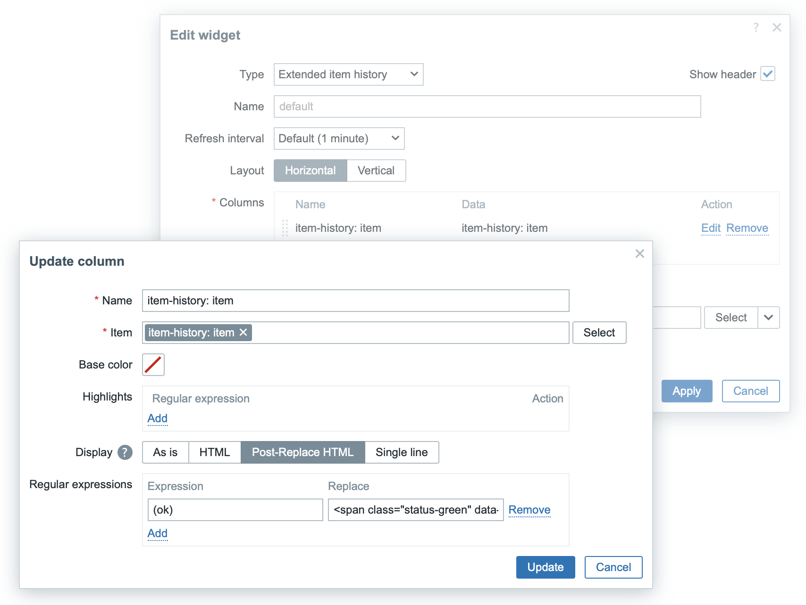

## Item history widget (extended)

Widget is modification of Zabbix Item history widget with additional "_Post-Replace HTML_" option to display text fields.

### Usage

Define "_Expression_" and "_Replace_" to match within HTML, is escaped before match, value and replace with non escaped HTML.

|Expression  |Replace  |Description  |
|------------|---------|-------------|
|`(ok)`      |`$1` |Display `ok` as span with green background.|

### Useful links

- Zabbix Item history widget documentation. [link](https://www.zabbix.com/documentation/7.0/en/manual/web_interface/frontend_sections/dashboards/widgets/item_history).
- Online serivce to test regex, [regex101.com](https://regex101.com/)
